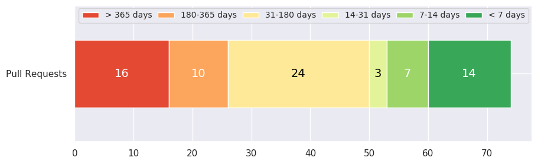
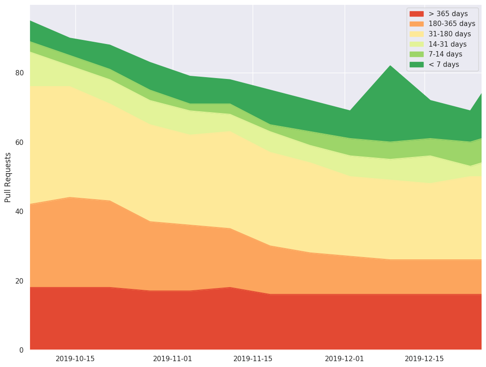
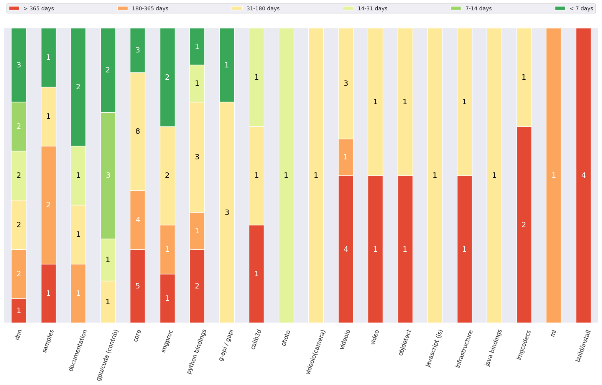

# Age distribution
## Overview
 - Average age of the pull requests: 209 days
 - Median age of the pull requests: 90 days

### Current age distribution

### Historical age distribution

## Age distribution by categories

## Age distribution by age categories
### Pull Requests with age: < 7 days
 - [PR#16230](https://github.com/opencv/opencv/pull/16230): cuda4dnn: improve host-device transfer performance
    __Age__: 0 day 
   __Labels__: [] 
   __Categories__: ('dnn',)
---
 - [PR#16229](https://github.com/opencv/opencv/pull/16229): Android remove Eclipse relicts
    __Age__: 1 day 
   __Labels__: [] 
   __Categories__: ('samples', 'java bindings')
---
 - [PR#16226](https://github.com/opencv/opencv/pull/16226): cuda4dnn(permute): improve reduction logic and add transpose kernel
    __Age__: 1 day 
   __Labels__: [] 
   __Categories__: ('dnn',)
---
 - [PR#16225](https://github.com/opencv/opencv/pull/16225): dnn: small fix in pose estimation model
    __Age__: 1 day 
   __Labels__: [] 
   __Categories__: ('dnn',)
---
 - [PR#16223](https://github.com/opencv/opencv/pull/16223): Add human parsing demo
    __Age__: 1 day 
   __Labels__: ['Label(name=category: dnn, description=None, type=LabelType.Category)'] 
   __Categories__: ('dnn',)
---
 - [PR#16222](https://github.com/opencv/opencv/pull/16222): Android move version info to Gradle style
    __Age__: 1 day 
   __Labels__: [] 
   __Categories__: ('infrastructure', 'java bindings')
---
 - [PR#16221](https://github.com/opencv/opencv/pull/16221): G-API: Fix G_TYPED_KERNEL_M macro
    __Age__: 2 days 
   __Labels__: ['Label(name=category: g-api / gapi, description=, type=LabelType.Category)'] 
   __Categories__: ('g-api / gapi',)
---
 - [PR#16220](https://github.com/opencv/opencv/pull/16220): cuda4dnn(ROIPooling): improve FP16 accuracy and optimize
    __Age__: 2 days 
   __Labels__: ['Label(name=category: dnn, description=None, type=LabelType.Category)', 'Label(name=category: gpu/cuda (contrib), description=OpenCV 4.0+: moved to opencv_contrib, type=LabelType.Category)', 'Label(name=optimization, description=None, type=LabelType.ChangesType)'] 
   __Categories__: ('dnn', 'gpu/cuda (contrib)')
---
 - [PR#16218](https://github.com/opencv/opencv/pull/16218): Enable cuda4dnn on hardware without support for __half
    __Age__: 3 days 
   __Labels__: ['Label(name=category: dnn, description=None, type=LabelType.Category)', 'Label(name=category: gpu/cuda (contrib), description=OpenCV 4.0+: moved to opencv_contrib, type=LabelType.Category)'] 
   __Categories__: ('dnn', 'gpu/cuda (contrib)')
---
 - [PR#16213](https://github.com/opencv/opencv/pull/16213): G-API: Using functors as kernel implementation
    __Age__: 4 days 
   __Labels__: ['Label(name=category: g-api / gapi, description=, type=LabelType.Category)'] 
   __Categories__: ('g-api / gapi',)
---
 - [PR#16199](https://github.com/opencv/opencv/pull/16199): Compute gradient x
    __Age__: 6 days 
   __Labels__: ['Label(name=category: photo, description=None, type=LabelType.Category)'] 
   __Categories__: ('photo',)
---
 - [PR#16190](https://github.com/opencv/opencv/pull/16190): Videocapture skip frames
    __Age__: 6 days 
   __Labels__: ['Label(name=category: videoio, description=None, type=LabelType.Category)', 'Label(name=feature, description=None, type=LabelType.ChangesType)', 'Label(name=pr: needs test, description=New functionality requires minimal tests set, type=LabelType.Problem)'] 
   __Categories__: ('videoio',)
---
 - [PR#16189](https://github.com/opencv/opencv/pull/16189): Enable 2-channel arrays in resize tests
    __Age__: 6 days 
   __Labels__: ['Label(name=bug, description=None, type=LabelType.ChangesType)', 'Label(name=category: imgproc, description=None, type=LabelType.Category)', 'Label(name=test, description=None, type=LabelType.ChangesType)'] 
   __Categories__: ('imgproc',)
---
 - [PR#16184](https://github.com/opencv/opencv/pull/16184): Added a helper function that will list all available Intel devices
    __Age__: 7 days 
   __Labels__: ['Label(name=category: dnn, description=None, type=LabelType.Category)'] 
   __Categories__: ('dnn',)
### Pull Requests with age: 7-14 days
 - [PR#16170](https://github.com/opencv/opencv/pull/16170): added tutorial for text skewness correction
    __Age__: 9 days 
   __Labels__: ['Label(name=category: samples, description=None, type=LabelType.Category)', 'Label(name=pr: needs rebase, description=Rebase patch (and squash fixup commits) on the top of target branch, type=LabelType.Problem)'] 
   __Categories__: ('samples',)
---
 - [PR#16164](https://github.com/opencv/opencv/pull/16164): [WIP] cuda4dnn(conv): fuse eltwise with convolutions
    __Age__: 10 days 
   __Labels__: ['Label(name=category: dnn, description=None, type=LabelType.Category)', 'Label(name=category: gpu/cuda (contrib), description=OpenCV 4.0+: moved to opencv_contrib, type=LabelType.Category)'] 
   __Categories__: ('dnn', 'gpu/cuda (contrib)')
---
 - [PR#16161](https://github.com/opencv/opencv/pull/16161): cuda4dnn(concat): write outputs from previous layers directly into concat's output
    __Age__: 11 days 
   __Labels__: ['Label(name=category: dnn, description=None, type=LabelType.Category)', 'Label(name=category: gpu/cuda (contrib), description=OpenCV 4.0+: moved to opencv_contrib, type=LabelType.Category)'] 
   __Categories__: ('dnn', 'gpu/cuda (contrib)')
---
 - [PR#16160](https://github.com/opencv/opencv/pull/16160): optimize cvCeil and cvFloor in fase_math.hpp
    __Age__: 11 days 
   __Labels__: ['Label(name=incomplete, description=None, type=LabelType.Problem)'] 
   __Categories__: ('core',)
---
 - [PR#16152](https://github.com/opencv/opencv/pull/16152): core: Workaround flip horiz
    __Age__: 11 days 
   __Labels__: ['Label(name=category: core, description=None, type=LabelType.Category)', 'Label(name=platform: arm, description=ARM boards related issues: RPi, NVIDIA TK/TX, etc, type=LabelType.Platform)'] 
   __Categories__: ('core',)
---
 - [PR#16146](https://github.com/opencv/opencv/pull/16146): Improve resize 8u3
    __Age__: 12 days 
   __Labels__: ['Label(name=category: imgproc, description=None, type=LabelType.Category)', 'Label(name=optimization, description=None, type=LabelType.ChangesType)'] 
   __Categories__: ('imgproc',)
---
 - [PR#16118](https://github.com/opencv/opencv/pull/16118): WIP: G-API: GOpaque implementation
    __Age__: 14 days 
   __Labels__: ['Label(name=category: g-api / gapi, description=, type=LabelType.Category)'] 
   __Categories__: ('g-api / gapi',)
### Pull Requests with age: 14-31 days
 - [PR#16063](https://github.com/opencv/opencv/pull/16063): support eltwise sum with different number of input channels in CUDA backend
    __Age__: 20 days 
   __Labels__: ['Label(name=category: dnn, description=None, type=LabelType.Category)', 'Label(name=category: gpu/cuda (contrib), description=OpenCV 4.0+: moved to opencv_contrib, type=LabelType.Category)', 'Label(name=feature, description=None, type=LabelType.ChangesType)', 'Label(name=optimization, description=None, type=LabelType.ChangesType)'] 
   __Categories__: ('dnn', 'gpu/cuda (contrib)')
---
 - [PR#16008](https://github.com/opencv/opencv/pull/16008): Python module: replace config.py files by config.ini
    __Age__: 27 days 
   __Labels__: [] 
   __Categories__: ('python bindings',)
---
 - [PR#15993](https://github.com/opencv/opencv/pull/15993):  This is a correction of the previously missleading documentation and a warning related to a common calibration failure described in issue #15992
    __Age__: 29 days 
   __Labels__: ['Label(name=category: documentation, description=None, type=LabelType.Category)', 'Label(name=pr: needs rebase, description=Rebase patch (and squash fixup commits) on the top of target branch, type=LabelType.Problem)'] 
   __Categories__: ('documentation',)
### Pull Requests with age: 31-180 days
 - [PR#15929](https://github.com/opencv/opencv/pull/15929): Update seamless_cloning.cpp
    __Age__: 37 days 
   __Labels__: [] 
   __Categories__: ('photo',)
---
 - [PR#15915](https://github.com/opencv/opencv/pull/15915): Fix implicit conversion from array to scalar in python bindings
    __Age__: 39 days 
   __Labels__: ['Label(name=RFC, description=None, type=LabelType.Other)', 'Label(name=category: python bindings, description=None, type=LabelType.Category)'] 
   __Categories__: ('python bindings',)
---
 - [PR#15907](https://github.com/opencv/opencv/pull/15907): G-API: unique_ptr for Priv in fluid
    __Age__: 41 days 
   __Labels__: ['Label(name=category: g-api / gapi, description=, type=LabelType.Category)'] 
   __Categories__: ('g-api / gapi',)
---
 - [PR#15889](https://github.com/opencv/opencv/pull/15889): Made buildImagePyramid free function
    __Age__: 43 days 
   __Labels__: ['Label(name=category: gpu/cuda (contrib), description=OpenCV 4.0+: moved to opencv_contrib, type=LabelType.Category)', 'Label(name=feature, description=None, type=LabelType.ChangesType)', 'Label(name=pr: needs test, description=New functionality requires minimal tests set, type=LabelType.Problem)'] 
   __Categories__: ('gpu/cuda (contrib)',)
---
 - [PR#15860](https://github.com/opencv/opencv/pull/15860): core(test): Test control characters in yml
    __Age__: 48 days 
   __Labels__: ['Label(name=bug, description=None, type=LabelType.ChangesType)', 'Label(name=category: core, description=None, type=LabelType.Category)', 'Label(name=pr: reproducer, description=Reproduces some bug, not expected to be merged, type=LabelType.Reproducer)'] 
   __Categories__: ('core',)
---
 - [PR#15840](https://github.com/opencv/opencv/pull/15840): G-API: Unify GKernelType and GKernelTypeM logic (+ GNetworkType)
    __Age__: 51 days 
   __Labels__: ['Label(name=category: g-api / gapi, description=, type=LabelType.Category)'] 
   __Categories__: ('g-api / gapi',)
---
 - [PR#15765](https://github.com/opencv/opencv/pull/15765): Use argument value for 'mat' in call to format for vector_mat and vector_mat_template
    __Age__: 62 days 
   __Labels__: ['Label(name=category: python bindings, description=None, type=LabelType.Category)', 'Label(name=pr: needs test, description=New functionality requires minimal tests set, type=LabelType.Problem)'] 
   __Categories__: ('python bindings',)
---
 - [PR#15727](https://github.com/opencv/opencv/pull/15727): Vectorizing normDiffInf for 8u,8s multichannel
    __Age__: 68 days 
   __Labels__: ['Label(name=category: core, description=None, type=LabelType.Category)', 'Label(name=optimization, description=None, type=LabelType.ChangesType)'] 
   __Categories__: ('core',)
---
 - [PR#15714](https://github.com/opencv/opencv/pull/15714): Support software triggering aravis cameras
    __Age__: 69 days 
   __Labels__: ['Label(name=category: videoio(camera), description=None, type=LabelType.Category)'] 
   __Categories__: ('videoio(camera)',)
---
 - [PR#15683](https://github.com/opencv/opencv/pull/15683): cv::magnitudeSqr()
    __Age__: 75 days 
   __Labels__: ['Label(name=category: core, description=None, type=LabelType.Category)', 'Label(name=feature, description=None, type=LabelType.ChangesType)'] 
   __Categories__: ('core',)
---
 - [PR#15682](https://github.com/opencv/opencv/pull/15682): added cv::magnitude(InputArray xy...)
    __Age__: 75 days 
   __Labels__: [] 
   __Categories__: ('core',)
---
 - [PR#15650](https://github.com/opencv/opencv/pull/15650): PnP issue 15647
    __Age__: 80 days 
   __Labels__: ['Label(name=RFC, description=None, type=LabelType.Other)', 'Label(name=category: calib3d, description=None, type=LabelType.Category)'] 
   __Categories__: ('calib3d',)
---
 - [PR#15599](https://github.com/opencv/opencv/pull/15599): Adding some MSA specific optimizations for imgproc/video/vidoeio/dnn …
    __Age__: 90 days 
   __Labels__: ['Label(name=optimization, description=None, type=LabelType.ChangesType)'] 
   __Categories__: ('video', 'imgproc', 'core', 'videoio', 'dnn')
---
 - [PR#15596](https://github.com/opencv/opencv/pull/15596): Improve copymask and implement SIMD extensions
    __Age__: 90 days 
   __Labels__: ['Label(name=category: core, description=None, type=LabelType.Category)', 'Label(name=optimization, description=None, type=LabelType.ChangesType)'] 
   __Categories__: ('core',)
---
 - [PR#15488](https://github.com/opencv/opencv/pull/15488): Vectorize minMaxIdx functions
    __Age__: 106 days 
   __Labels__: ['Label(name=category: core, description=None, type=LabelType.Category)', 'Label(name=optimization, description=None, type=LabelType.ChangesType)'] 
   __Categories__: ('core',)
---
 - [PR#15464](https://github.com/opencv/opencv/pull/15464): Fix issue #6450
    __Age__: 110 days 
   __Labels__: ['Label(name=platform: ios/osx, description=, type=LabelType.Platform)'] 
   __Categories__: ('videoio',)
---
 - [PR#15463](https://github.com/opencv/opencv/pull/15463): DNN: multiple outputs for asynchronous inference
    __Age__: 110 days 
   __Labels__: ['Label(name=category: dnn, description=None, type=LabelType.Category)'] 
   __Categories__: ('dnn',)
---
 - [PR#15454](https://github.com/opencv/opencv/pull/15454): VideoCapture get property with range and default value support
    __Age__: 111 days 
   __Labels__: ['Label(name=RFC, description=None, type=LabelType.Other)', 'Label(name=category: videoio, description=None, type=LabelType.Category)'] 
   __Categories__: ('videoio',)
---
 - [PR#15338](https://github.com/opencv/opencv/pull/15338): QR-Code detector : multiple detection
    __Age__: 127 days 
   __Labels__: ['Label(name=category: objdetect, description=None, type=LabelType.Category)', 'Label(name=feature, description=None, type=LabelType.ChangesType)'] 
   __Categories__: ('objdetect',)
---
 - [PR#15311](https://github.com/opencv/opencv/pull/15311): `solvePnP`and 'projectPoints' for calib3d and face module
    __Age__: 131 days 
   __Labels__: ['Label(name=category: javascript (js), description=None, type=LabelType.Category)', 'Label(name=pr: reproducer, description=Reproduces some bug, not expected to be merged, type=LabelType.Reproducer)'] 
   __Categories__: ('javascript (js)',)
---
 - [PR#15240](https://github.com/opencv/opencv/pull/15240): Samples and tutorials for the Dnn High Level API
    __Age__: 141 days 
   __Labels__: [] 
   __Categories__: ('documentation', 'samples')
---
 - [PR#15214](https://github.com/opencv/opencv/pull/15214): WIP: imgproc: templmatch: Add support for mask for all methods 
    __Age__: 143 days 
   __Labels__: ['Label(name=category: imgproc, description=None, type=LabelType.Category)', 'Label(name=feature, description=None, type=LabelType.ChangesType)'] 
   __Categories__: ('imgproc',)
---
 - [PR#15087](https://github.com/opencv/opencv/pull/15087): [WIP] Support ROI + UMat in own::Mat
    __Age__: 159 days 
   __Labels__: ['Label(name=category: g-api / gapi, description=, type=LabelType.Category)'] 
   __Categories__: ('g-api / gapi',)
---
 - [PR#14971](https://github.com/opencv/opencv/pull/14971): multi-images + meta-properties
    __Age__: 174 days 
   __Labels__: [] 
   __Categories__: ('python bindings', 'infrastructure', 'core', 'imgcodecs', 'java bindings')
### Pull Requests with age: 180-365 days
 - [PR#14666](https://github.com/opencv/opencv/pull/14666): Python code examples for file IO in xml and yml format
    __Age__: 210 days 
   __Labels__: ['Label(name=category: documentation, description=None, type=LabelType.Category)', 'Label(name=category: samples, description=None, type=LabelType.Category)'] 
   __Categories__: ('documentation', 'samples')
---
 - [PR#14325](https://github.com/opencv/opencv/pull/14325): DNN: Optimization fuse: Conv -> Eltwise -> BatchNorm
    __Age__: 254 days 
   __Labels__: ['Label(name=category: dnn, description=None, type=LabelType.Category)'] 
   __Categories__: ('dnn',)
---
 - [PR#14135](https://github.com/opencv/opencv/pull/14135): Heterogeneous plugin of Intel's Inference Engine
    __Age__: 275 days 
   __Labels__: [] 
   __Categories__: ('dnn',)
---
 - [PR#14107](https://github.com/opencv/opencv/pull/14107): Adding python codes to samples/python
    __Age__: 280 days 
   __Labels__: ['Label(name=category: python bindings, description=None, type=LabelType.Category)', 'Label(name=category: samples, description=None, type=LabelType.Category)', 'Label(name=pr: needs rebase, description=Rebase patch (and squash fixup commits) on the top of target branch, type=LabelType.Problem)'] 
   __Categories__: ('python bindings', 'samples')
---
 - [PR#14035](https://github.com/opencv/opencv/pull/14035): add Y16/GRAY16_LE support to gstreamer
    __Age__: 288 days 
   __Labels__: ['Label(name=category: videoio, description=None, type=LabelType.Category)', 'Label(name=feature, description=None, type=LabelType.ChangesType)'] 
   __Categories__: ('videoio',)
---
 - [PR#13930](https://github.com/opencv/opencv/pull/13930): added CV_MAT_DEPTH_IS_FLOAT() and CV_MAT_DEPTH_IS_SIGNED()
    __Age__: 299 days 
   __Labels__: [] 
   __Categories__: ('core',)
---
 - [PR#13928](https://github.com/opencv/opencv/pull/13928): Add division operators for Matx.
    __Age__: 300 days 
   __Labels__: ['Label(name=RFC, description=None, type=LabelType.Other)', 'Label(name=category: core, description=None, type=LabelType.Category)'] 
   __Categories__: ('core',)
---
 - [PR#13879](https://github.com/opencv/opencv/pull/13879): add REDUCE_SUM2
    __Age__: 307 days 
   __Labels__: [] 
   __Categories__: ('ml', 'core')
---
 - [PR#13869](https://github.com/opencv/opencv/pull/13869): LineVirtualIterator
    __Age__: 308 days 
   __Labels__: ['Label(name=category: imgproc, description=None, type=LabelType.Category)', 'Label(name=feature, description=None, type=LabelType.ChangesType)', 'Label(name=pr: needs test, description=New functionality requires minimal tests set, type=LabelType.Problem)'] 
   __Categories__: ('imgproc',)
---
 - [PR#13570](https://github.com/opencv/opencv/pull/13570): Fix bugs in arithm_op() for InputArray (src == dst) case.
    __Age__: 355 days 
   __Labels__: ['Label(name=RFC, description=None, type=LabelType.Other)', 'Label(name=bug, description=None, type=LabelType.ChangesType)', 'Label(name=category: core, description=None, type=LabelType.Category)'] 
   __Categories__: ('core',)
### Pull Requests with age: > 365 days
 - [PR#13368](https://github.com/opencv/opencv/pull/13368): Support of Unicode file paths under Windows
    __Age__: 384 days 
   __Labels__: [] 
   __Categories__: ('core', 'python bindings', 'imgcodecs')
---
 - [PR#13068](https://github.com/opencv/opencv/pull/13068): objdetect: 'const' correctness
    __Age__: 412 days 
   __Labels__: ['Label(name=RFC, description=None, type=LabelType.Other)', 'Label(name=category: build/install, description=None, type=LabelType.Category)', 'Label(name=category: objdetect, description=None, type=LabelType.Category)'] 
   __Categories__: ('build/install', 'objdetect')
---
 - [PR#12588](https://github.com/opencv/opencv/pull/12588): Add .clang-format to help to enforce code format
    __Age__: 462 days 
   __Labels__: [] 
   __Categories__: ('infrastructure',)
---
 - [PR#12549](https://github.com/opencv/opencv/pull/12549): cmake: split opencv_modules.hpp
    __Age__: 465 days 
   __Labels__: ['Label(name=RFC, description=None, type=LabelType.Other)', 'Label(name=category: build/install, description=None, type=LabelType.Category)'] 
   __Categories__: ('build/install',)
---
 - [PR#12481](https://github.com/opencv/opencv/pull/12481): build: OpenCV includes
    __Age__: 470 days 
   __Labels__: ['Label(name=RFC, description=None, type=LabelType.Other)', 'Label(name=category: build/install, description=None, type=LabelType.Category)'] 
   __Categories__: ('build/install',)
---
 - [PR#12290](https://github.com/opencv/opencv/pull/12290): 16-bit Grayscale and 48 bit RGB with FFV1 lossless as part of #12284 with tests
    __Age__: 488 days 
   __Labels__: ['Label(name=category: videoio, description=None, type=LabelType.Category)'] 
   __Categories__: ('videoio',)
---
 - [PR#12186](https://github.com/opencv/opencv/pull/12186): samples: refactor DNN model downloading
    __Age__: 503 days 
   __Labels__: ['Label(name=category: dnn, description=None, type=LabelType.Category)', 'Label(name=category: samples, description=None, type=LabelType.Category)'] 
   __Categories__: ('dnn', 'samples')
---
 - [PR#11885](https://github.com/opencv/opencv/pull/11885): RFC: merge fisheye camera into default camera calibration API
    __Age__: 539 days 
   __Labels__: ['Label(name=RFC, description=None, type=LabelType.Other)', 'Label(name=category: calib3d, description=None, type=LabelType.Category)'] 
   __Categories__: ('calib3d',)
---
 - [PR#11880](https://github.com/opencv/opencv/pull/11880): videoio(MSMF): allow -1 index to open the first available camera
    __Age__: 539 days 
   __Labels__: ['Label(name=category: videoio, description=None, type=LabelType.Category)'] 
   __Categories__: ('videoio',)
---
 - [PR#11539](https://github.com/opencv/opencv/pull/11539): Added two optimization methods: BFGS and L-BFGS
    __Age__: 586 days 
   __Labels__: ['Label(name=category: core, description=None, type=LabelType.Category)', 'Label(name=feature, description=None, type=LabelType.ChangesType)'] 
   __Categories__: ('core',)
---
 - [PR#10628](https://github.com/opencv/opencv/pull/10628): added cap field for VideoWriter (constructor, open, C interface) for …
    __Age__: 705 days 
   __Labels__: ['Label(name=category: videoio, description=None, type=LabelType.Category)', "Label(name=future, description=This issue can't be fixed during restrictions of the master branch compatibility requirements, type=LabelType.ChangesType)"] 
   __Categories__: ('videoio',)
---
 - [PR#10318](https://github.com/opencv/opencv/pull/10318): For various PR tests
    __Age__: 739 days 
   __Labels__: ['Label(name=pr: reproducer, description=Reproduces some bug, not expected to be merged, type=LabelType.Reproducer)', 'Label(name=test, description=None, type=LabelType.ChangesType)'] 
   __Categories__: ('java bindings',)
---
 - [PR#10131](https://github.com/opencv/opencv/pull/10131): JUST TEST
    __Age__: 762 days 
   __Labels__: ['Label(name=pr: reproducer, description=Reproduces some bug, not expected to be merged, type=LabelType.Reproducer)'] 
   __Categories__: ('core', 'imgproc')
---
 - [PR#9123](https://github.com/opencv/opencv/pull/9123): Support CV_CAP_MODE_GRAY in FFMPEG backend
    __Age__: 899 days 
   __Labels__: ['Label(name=RFC, description=None, type=LabelType.Other)', 'Label(name=category: videoio, description=None, type=LabelType.Category)'] 
   __Categories__: ('videoio',)
---
 - [PR#8511](https://github.com/opencv/opencv/pull/8511): export img decoders/encoders
    __Age__: 995 days 
   __Labels__: ['Label(name=RFC, description=None, type=LabelType.Other)', 'Label(name=category: imgcodecs, description=None, type=LabelType.Category)'] 
   __Categories__: ('imgcodecs',)
---
 - [PR#6722](https://github.com/opencv/opencv/pull/6722): OpenCV addons
    __Age__: 1279 days 
   __Labels__: [] 
   __Categories__: ('video', 'core', 'build/install', 'python bindings')
