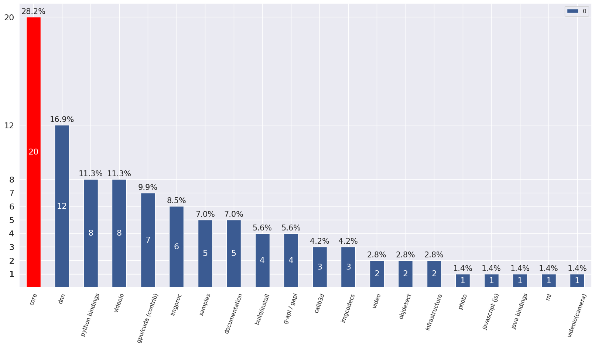

# Categories distribution
## Overview
Total percentage may exceed 100%, because several categories may be assigned to 1 pull request.
 
## Pull requests with auto assigned categories
Categories are assigned based on path of the changed files.

  - [PR#16230](https://github.com/opencv/opencv/pull/16230): cuda4dnn: improve host-device transfer performance
    __Assigned categories__: ('dnn',)
---
 - [PR#16229](https://github.com/opencv/opencv/pull/16229): Android remove Eclipse relicts
    __Assigned categories__: ('samples', 'java bindings')
---
 - [PR#16226](https://github.com/opencv/opencv/pull/16226): cuda4dnn(permute): improve reduction logic and add transpose kernel
    __Assigned categories__: ('dnn',)
---
 - [PR#16225](https://github.com/opencv/opencv/pull/16225): dnn: small fix in pose estimation model
    __Assigned categories__: ('dnn',)
---
 - [PR#16222](https://github.com/opencv/opencv/pull/16222): Android move version info to Gradle style
    __Assigned categories__: ('infrastructure', 'java bindings')
---
 - [PR#16160](https://github.com/opencv/opencv/pull/16160): optimize cvCeil and cvFloor in fase_math.hpp
    __Assigned categories__: ('core',)
---
 - [PR#16008](https://github.com/opencv/opencv/pull/16008): Python module: replace config.py files by config.ini
    __Assigned categories__: ('python bindings',)
---
 - [PR#15929](https://github.com/opencv/opencv/pull/15929): Update seamless_cloning.cpp
    __Assigned categories__: ('photo',)
---
 - [PR#15682](https://github.com/opencv/opencv/pull/15682): added cv::magnitude(InputArray xy...)
    __Assigned categories__: ('core',)
---
 - [PR#15599](https://github.com/opencv/opencv/pull/15599): Adding some MSA specific optimizations for imgproc/video/vidoeio/dnn …
    __Assigned categories__: ('video', 'imgproc', 'core', 'videoio', 'dnn')
---
 - [PR#15464](https://github.com/opencv/opencv/pull/15464): Fix issue #6450
    __Assigned categories__: ('videoio',)
---
 - [PR#15240](https://github.com/opencv/opencv/pull/15240): Samples and tutorials for the Dnn High Level API
    __Assigned categories__: ('documentation', 'samples')
---
 - [PR#14971](https://github.com/opencv/opencv/pull/14971): multi-images + meta-properties
    __Assigned categories__: ('python bindings', 'infrastructure', 'core', 'imgcodecs', 'java bindings')
---
 - [PR#14135](https://github.com/opencv/opencv/pull/14135): Heterogeneous plugin of Intel's Inference Engine
    __Assigned categories__: ('dnn',)
---
 - [PR#13930](https://github.com/opencv/opencv/pull/13930): added CV_MAT_DEPTH_IS_FLOAT() and CV_MAT_DEPTH_IS_SIGNED()
    __Assigned categories__: ('core',)
---
 - [PR#13879](https://github.com/opencv/opencv/pull/13879): add REDUCE_SUM2
    __Assigned categories__: ('ml', 'core')
---
 - [PR#13368](https://github.com/opencv/opencv/pull/13368): Support of Unicode file paths under Windows
    __Assigned categories__: ('core', 'python bindings', 'imgcodecs')
---
 - [PR#12588](https://github.com/opencv/opencv/pull/12588): Add .clang-format to help to enforce code format
    __Assigned categories__: ('infrastructure',)
---
 - [PR#10318](https://github.com/opencv/opencv/pull/10318): For various PR tests
    __Assigned categories__: ('java bindings',)
---
 - [PR#10131](https://github.com/opencv/opencv/pull/10131): JUST TEST
    __Assigned categories__: ('core', 'imgproc')
---
 - [PR#6722](https://github.com/opencv/opencv/pull/6722): OpenCV addons
    __Assigned categories__: ('video', 'core', 'build/install', 'python bindings')
